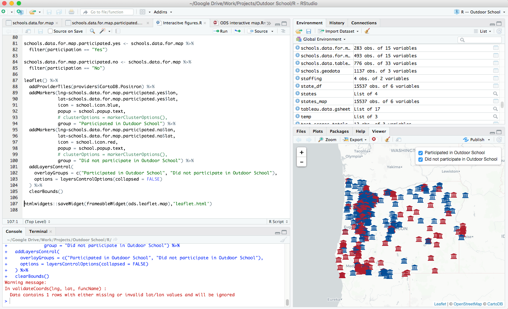
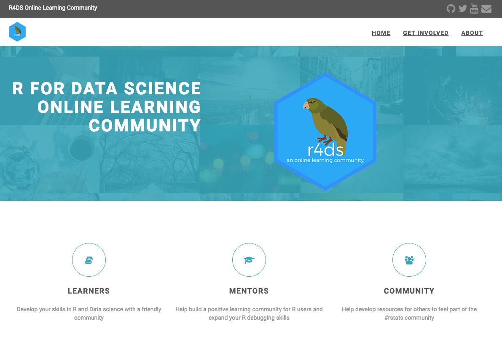

```{r child = "setup.Rmd"}
```


```{r packages, include = F, eval = T}


library(tidyverse)
library(skimr)
library(janitor)
library(DT)
library(here)
library(kableExtra)
library(knitr)


```

class: center, middle, dk-section-title

background-image: url("images/installation.jpeg")

# Installation


---

## Install R

The first thing you need to do is download the R software. Go to the [Comprehensive R Archive Network (aka “CRAN”) website](https://cran.cnr.berkeley.edu/) and download the software for your operating system (Windows, Mac, or Linux).


---


### Working Directly in R


---

## RStudio

--

.center[


.small[Courtesy [Modern Dive](http://moderndive.com/2-getting-started.html#what-are-r-and-rstudio)]
]

---

### RStudio

If you use RStudio, you’ll have a graphical user interface, the ability to see all of your stored information, and much more.




---

### Download RStudio

Download RStudio at the [RStudio website](https://www.rstudio.com/products/rstudio/download/#download). Ignore the various versions listed there. All you need is the latest version of RStudio Desktop.


---


### Tour of RStudio

.center[

]


---
class: center, middle, dk-section-title

background-image: url("images/packages.jpg")

# Packages

---

## Packages

Packages add functionality that is not present in base R. 

They're where much of the power of R is found.

--

.center[


.small[Courtesy [Modern Dive](http://moderndive.com/2-getting-started.html#packages)]
]


---

## Packages We'll Use

.pull-left[

.center[

]

]


.pull-right[

### `tidyverse`

The [`tidyverse`](https://tidyverse.org/) is a collection of packages. 

We'll use [`readr`](https://readr.tidyverse.org/) to import data. 

]

---

## Packages We'll Use


.pull-left[

### `skimr`

[`skimr`](https://github.com/ropensci/skimr) provides easy summary statistics.

]


.pull-right[

.center[

]


]

---


## Install Packages

The syntax to install packages is as follows. 

```{r eval=F}
install.packages("tidyverse")
install.packages("skimr")
```

The package name must be in quotes.

--

.dk-highlight-box[
Packages should be installed **once per computer** (i.e. once you've installed a package, you don't need to do it again on the same computer).
]

---

## Load Packages

To load packages, use the following syntax:

```{r eval = T}
library(tidyverse)
library(skimr)
```

Package names don't need to be quoted here (though they can be).

--

.dk-highlight-box[
Packages should be loaded **once per session** (i.e. every time you start working in R, you need to load any packages you want to use). 
]


---

class: center, middle, dk-section-title

background-image: url("images/data.jpg")


# Import Data


---

## Import Data

Let's read data from a CSV file. 


```{r eval = T, echo = F}

faketucky <- read_csv(here("data", "faketucky.csv"))


```

```{r}

faketucky <- read_csv("data/faketucky.csv")


```

We now have a data frame/tibble called `faketucky` that we can work with in R.


???

- Tibbles are ["modern data frames"](https://cran.r-project.org/web/packages/tibble/vignettes/tibble.html). The main difference for our purposes is that tibbles print much more nicely within R. 

- We'll use the terms tibble and data frame interchangeably. 

- For Excel files, try `read_excel` from the `readxl` package. 

- For SPSS files, try `read_sav` from the `haven` package.


---

## Where Does our Data Live?

Data we have imported is available in the environment/history pane.

.center[

]

---
class: center, middle, dk-section-title

background-image: url("images/glasses.jpeg")


# Examine Our Data


---

## Examine Our Data

There are many ways to look at our data. We'll talk about a few.


---

## `faketucky`

If you type the name of your data frame (i.e. `faketucky`), R will output the following: 
```{r}
faketucky
```

--

```{r eval = T, paged.print = F, echo = F}
faketucky
```

---


## `View`

`View` (note capital V) opens the RStudio viewer (or click on a data frame in the environment pane).

```{r paged.print = F}
View(faketucky)
```

---


## `skimr`

The skimr package provides more detailed information about our data frame. It is also broken up by the type of variable.

```{r}

skim(faketucky)

```

--

```{r eval = T, paged.print = F, echo = F}

skim(faketucky)

```

---


class: center, middle, dk-section-title

background-image: url("images/help.jpeg")

# Getting Help

---

### ?function

Use the ? to get help about anything you're confused about

```{r}

?read_csv

```

---

## Tidyverse Website

[](https://www.tidyverse.org/)

---


## Package Vignettes

[](https://cran.r-project.org/web/packages/skimr/vignettes/Using_skimr.html)

---

## Twitter

[](https://twitter.com/search?q=%23rstats)

---

## R for Data Science Community

[](https://www.rfordatasci.com/)

---

## Google

[](https://twitter.com/ekaleedmiston/status/1081221822186696706)


